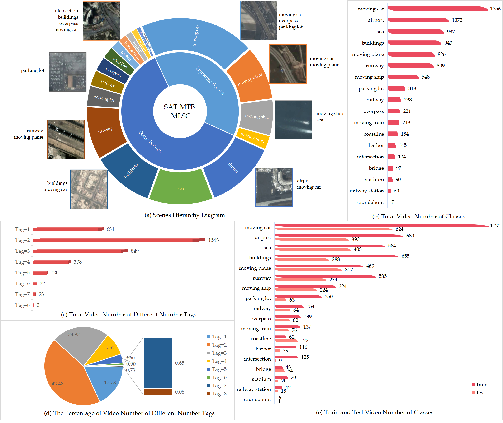
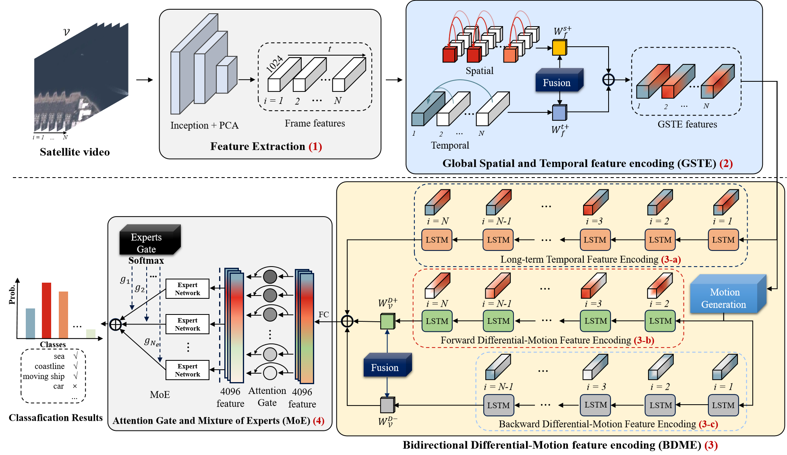

<div align="center">
  
  <div>&nbsp;</div>
  <div align="center">
    <b><font size="5">SAT-MTB-MLSC website</font></b>
    <sup>
      <a href="http://www.csu.cas.cn/gb/kybm/sjlyzx/gcxx_sjj/sjj_wxxl/202304/t20230410_6728890.html">
        <i><font size="4">HOT</font></i>
      </a>
    </sup>
    &nbsp;&nbsp;&nbsp;&nbsp;
    <b><font size="5">MLSC Baseline and Benchmark </font></b>
    <sup>
      <a href="https://github.com/Kingdroper/STFCE">
        <i><font size="4">TRY IT OUT</font></i>
      </a>
    </sup>
  </div>
  <div>&nbsp;</div>
</div>

  ## Introduction 
  This is the official implementation of our paper ["Satellite Video Multi-Label Scene Classification With Spatial and Temporal Feature Cooperative Encoding: A Benchmark Dataset and Method"](https://ieeexplore.ieee.org/document/10471306).
  
  **<big>This is the first publicly available and large-scale satellite video multi-label scene classification dataset.</big>**  
  It consists of 18 classes of static and dynamic ground contents, 3549 videos, and 141960 frames. We also propose a baseline method STFCE.
  Our Dataset:


  Our STFCE:

  
  **We hope that this work provides a new research topic for researchers to promote the applications of satellite video.**
  
  Train and val dataset:[DATASET.zip](https://pan.baidu.com/s/1_trIj3LwNcudfzw6F3MYNw?pwd=myqp)
  
  Train and val frame features extracted by Inception network: [Train and Val frame features.zip](https://pan.baidu.com/s/1lVou-uJWY8_GJifOqw9asA?pwd=4eka)

  STFCE models: [best model](https://pan.baidu.com/s/1cDR6B5lYKee0CI9pY5HlVA?pwd=utx8)

  ## Installation
  All our experiments were done on 4 Tesla V100 GPUs. We imported our conda and pip environment configurations into two files：conda_env.yml and requirements.txt.
  - Use the following code to reproduce the environment and make sure your GPUs are available：
  ```python
conda env create -f conda_env.yml
pip install -r requirements.txt
  ```

- Download the dataset, train-val frame features, and our pretrained models using above link. Then put them in the code root directory. We use the extracted frame features to train and test our model. Test our model:
```python
python eval.py --eval_data_pattern="val.tfrecord" --model=LstmModel --train_dir=stfce_model --frame_features=True --feature_names="rgb" --feature_sizes="1024" --batch_size=1024 --base_learning_rate=0.0002 --lstm_random_sequence=True --run_once=True --top_k=18 --num_classes=18
```
- Train our model:
```python
python train.py --train_data_pattern=train.tfrecord --model=LstmModel --train_dir=stfce_model --frame_features=True --feature_names="rgb" --feature_sizes="1024" --batch_size=80 --base_learning_rate=0.0002 --lstm_random_sequence=True --max_step=1000 --num_classes=18 --export_model_steps=100 --num_epochs=36
```

- We also support other models, please refer to [Gated NetVLAD, Gated NetFV...](./Read.md)

## Citation
If you find this project useful in your research, please consider cite:

```BibTeX
@ARTICLE{10471306,
  author={Guo, Weilong and Li, Shengyang and Chen, Feixiang and Sun, Yuhan and Gu, Yanfeng},
  journal={IEEE Transactions on Image Processing}, 
  title={Satellite Video Multi-Label Scene Classification With Spatial and Temporal Feature Cooperative Encoding: A Benchmark Dataset and Method}, 
  year={2024},
  volume={33},
  pages={2238-2251},
  doi={10.1109/TIP.2024.3374100}}
```
